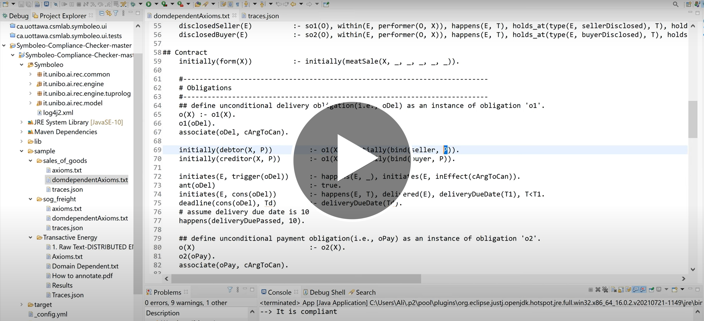

# SymboleoCC: A Compliance Checker Tool for Legal Contracts

[](https://zenodo.org/badge/latestdoi/263669871)

[](https://youtu.be/kej6JNwVumk)
	
:bookmark_tabs: [Symboleo: Towards a specification language for legal contracts](http://www.eiti.uottawa.ca/~luigi/papers/20_RE.pdf)

:bookmark_tabs: [Subcontracting, assignment, and substitution for legal contracts in symboleo](https://site.uottawa.ca/~luigi/papers/20_ER.pdf)

## What is Symboleo?
Symboleo is a formal specification language for legal contracts. It describes contracts in terms of contractual norms such as obligations, powers, etc.  Symboleo is an event-based language that inherits event-calculus predicates to specify norms in terms of situations. Contractual norms evolve over time according to events occurring at time points specified in the language. In other words, internal (e.g., deadlines) and external events (e.g., payments) may change the state of the norms during time. Three state machines represent the evolution semantics of norms while corresponding formal specifications have been axiomatized in the [tutorial document](https://sites.google.com/d/1ZRxGZ5SOQxevA_g_30OBwhFcCb24U-0G/p/1hfvgq2pXeFr-LG4o1w4hCA9wXaqOUCzI/edit). The state machines are given in our accepted paper titled [Symboleo: Towards a Specification Language for Legal Contracts](https://ieeexplore.ieee.org/iel7/9211511/9218128/09218159.pdf?casa_token=E_9JqcpDU4QAAAAA:8XdvkP6qBW740zDMMZtvteJ6U35Hzi8PO9rICsXftg-uoXlcU3OMpnVqmEainyvdOaKK0KFFLQ).

## SymboleoCC
This tool is a compliance checker for formal contract specifications written in Symboleo. It was inspired by the tool [jREC](https://www.inf.unibz.it/~montali/tools.html). It evaluates whether given sequences of events (i.e., traces) are compliant with given contract specifications. To this end, the tool supports Symboleo's primitive predicates (such as **within** and **occur**), axiomatized semantics, description of contracts, and compliance scenarios. For each contract specification, we have a part consisting of reusable, domain-independent axioms and a contract-specific part, both written in Prolog. The reusable axioms are replicated in each contract. They formalize the state machines of norms. The contract-specific part describes  the list of parameterized obligations and powers that is specific to each contract. Symboleo proposes templates for contracts, obligations, powers, and events. For example, the signature of an obligation is **\<trigger\> -> \<name\> : O(debtor, creditor, antecedent, consequent)**, and is modeled in the tool as shown below:
```
o(X) :- o1(X).
o1(oDel).
associate(oDel, cArgToCan).
	
initially(debtor(X, P)) 	:- o1(X), initially(bind(seller, P)).
initially(creditor(X, P)) 	:- o1(X), initially(bind(buyer, P)).
	
initiates(E, trigger(oDel))	:- happens(E, _), initiates(E, inEffect(cArgToCan)). 
ant(oDel) :- true.	
initiates(E, cons(oDel)) 	:- happens(E, T), delivered(E), deliveryDueDate(T1), T<T1.
deadline(cons(oDel), 10).
happens(deliveryDuePassed, 10).
 ``` 
where **oDel** and **cArgToCan** are an instance of delivery obligation and Sales of Good contract respectively.\
As mentioned, the execution of contracts is controlled by events. Sequences of events alongside expected properties are defined in batch files that are fed sequentially into the Prolog programs described above. Attributes of events distinguish events that can happen in any order because of the reactive nature of the tool. Traces put contracts in new situations that should be compliant with expected properties.

### How to Specify Contracts in Symboleo?
A contract specification in Symboleo has two main sections: a **Domain** section and a **Contract Body** section. In the the domain section, you will be defining the data-model of the elements that are related to the (business) domain of the contract template you wish to specify. Some basic and ontological concepts (for more information on the ontology please consult [our paper](https://drive.google.com/file/d/1WXwXeLrZdaJjhSJcCrt_wBXxDvhFkq2k/view)) are predefined in the language. Every other concept that is defined in the domain model is an extension of the pre-defined concepts. *Note: Symboleo supports both time points and intervals. Since there is a one-to-one correspondance between events and time-points, and situations and time intervals; they can be used interchangeably.*

**Table1: Semantics of domain independent predicates**

|Rule Name|Description|
|---------------------|-----------|
|o(X)			|'X' is an instance of an obligation|
|p(X)			|'X' is an instance of a power|
|role(X)		|'X' is an instance of a role|
|asset(X)		|'X' is an instance of an asset|
|event(X)		|'X' is an instance of an event|
|subcontracted(E, Obls, Cnts, Ps)		|event 'E' subcontracts obligations 'Obls' through subcontracts 'Cnts' to parties 'Ps' respectively|
|assignedR(E, Pows, Pold, Pnew)		|event 'E' assigns powers 'Pows' from party 'Pold' to party 'Pnew'|
|consented(E1, E2)					|occurrence of event 'E1' consents occurrence of event 'E2'|
|deadline(S, T)|deadline of situation 'S' is time point 'T'|
|bind(R, P)	|bind role 'R' to party 'P'|
|associate(X, C)	 |associates an obligation/power instance 'X' with an instance of contract 'C'|
|debtor(X, P)	|debtor of an obligation/power instance 'X' is party 'P'|
|creditor(X, P)|creditor of an obligation/power instance 'X' is party 'P'|
|trigger(X)	|a situation that indicates trigger of an obligation/power instance 'X'|
|ant(X)		|a situation that indicates antecedent of an obligation/power instance 'X'|
|cons(X)		|a situation that indicates consequent of an obligation/power instance 'X'|
|initially(S)	|a situation 'S' is initiated at start time(-1)|
|within(E, S)	|a situation 'S' holds when event 'E' happens|
|initiates(E, S)|an event 'E' brings about a situation 'S'|
|terminates(E, S)|an event 'E' terminates a situation 'S'|
|happens(E, T)|an event 'E' happens at time point 't'|
|holds_at(S, T)|a situation 'S' holds at time point 't'|
|performer(O, X)|party 'X' is performer of obligation 'O'|
|rightHolder(O, X)|party 'X' is rightHolder of obligation 'O'|


**Table2: Description of domain dependent rules**
|Contract Body Element|Description|Sample Rules|
|---------------------|-----------|----------------|
|`Domain`|Domain related data types such as events, assets and roles| `role(buyer).`<br/>`asset(X):- perishableGood(X).` <br/> `event(X) :- paid(X).`|
|`Declarations`|the parameters are bound to the variables which are defined based on the `Domain Model` of the contract. Input events determine values of variables.| `paid(E):- o2(O), within(E, performer(O, X)), within(E, rightHolder(O, Y)), happens(E, T), holds_at(type(E, paid), T), holds_at(from(E, X), T), holds_at(to(E, Y), T), holds_at(amount(E, 1000), T).` </br> - where situations `type(E, paid)` and `to(E, Y)` and `amount(E, 1000)` are determined in traces. </br> - This rule indicates if an event `E` with type `paid` and amount `1000` happens from party `X` who is performer of obligation `o2`(payment obligation) to party `Y` who is receiver, then `paid(E)` which is known event inside the contract is triggered  </br></br> `c(X):initially(meatSale(X, _, _, _, _, _)).`</br> where `meatSales(`**`name`**, **`buyer`**, **`seller`**, **`meat package id`**, **`delivery due date`**, **`payment due date`**`)` comes from traces and instantiates a meat sales contract|
|`Obligations`|obligations have a name, a trigger(*optional*), two roles, an antecedent and a consequent. the trigger when satisfied, creates an instance of the obligation, while satisfying its antecedent will bring it to an *active state*, i.e. the debtor of the obligation _**must**_ satisfy the consequent.|`o(X) :- o2(X).`</br>`o2(oPay).`</br>`associate(oPay, cArgToCan).`</br>`initially(debtor(X, P)) :- o2(X), initially(bind(buyer, P)).`</br>`initially(creditor(X, P)) :- o2(X), initially(bind(seller, P)).`</br>`initiates(E, trigger(oPay)):- happens(E, _), initiates(E, inEffect(cArgToCan)).`</br>`ant(oPay) :- true.`</br>`initiates(E, cons(oPay)) :-happens(E, T), paid(E), paymentDueDate(Tp), T<Tp.`</br>`deadline(cons(oPay), Tp) :- paymentDueDate(Tp).`</br></br>- indicates `oPay` is an instance of obligation `o2`, associated to contract `cArgToCan`, its debtor and creditor are the parties who bound to buyer and seller respectively. It is triggered once contract goes to inEffect state. Its antecedent is always true(unconditional) while consequent is payment before deadline |
|`Powers`|powers have a name, a trigger(*optional*), two roles, an antecedent and a consequent. the trigger when satisfied, creates an instance of the power, while satisfying its antecedent will bring it to an *active state*, i.e. the creditor of the power _**can**_ satisfy the consequent which is usually about creating, suspending, resuming or terminating the obligations/contract.| `p(X) :- p1(X).`</br>`p1(pSusDelivery).`</br>`associate(pSusDelivery, cArgToCan).`</br>`initially(debtor(X, P)) :- p1(X), initially(bind(buyer, P)). initially(creditor(X, P)) :- p1(X), initially(bind(seller, P)).`</br>`ant(pSusDelivery) :- true.`</br>`suspension(oDel) :- cons(pSusDelivery).`</br>`initiates(E, trigger(pSusDelivery)) :- happens(E, _), initiates(E, violation(oPay)).`</br>`happens(exerted(pSusDelivery), T) :- happens(suspended(oDel), T).`</br></br>- indicates pSusDelivery is an instance of power `p1`, associated to `cArgToCan` contract, similarly the debtor and creditor are buyer and seller while antecedent is always true and consequent is suspension of obligation `oDel`. The power is triggered whenever obligation `oPay` is violated. If seller triggers event `suspended(oDel)`, the power is exerted.|
|`Surviving Obligations`|a type of obligation that stay alive after contract termination. These obligations are defined same as general obligations however `so(X)` is used instead of `o(X)`, |`so(X):- so1(X).`</br>`so1(soSellerDisclosure).`|

### How to define a scenario 
A scenario includes six elements:
- **name:** a meaningful name for the trace
- **description:** a short explanation of trace
- **initials:** a list of situations that shall be true before the trace is executed
- **events:** a trace of events alongside happening time
- **attributes:** a list of events' attributes
- **expectedStates:** a list of expected situations that must be true after trace execution 

For example, the below scenario drafts `cArgToCan` meatSale contract between `eatMart` and `greatArgMeat` for deliverying `meatPacked` before time 10 while agreed money must be paid before time 7. The contract is started at time 0 by event started(cArgToCan),0" and event `delToBuyer` whose type is delivered from `greatArgMeat` to `meatPacked` happens at time 7. Eventually, we expect that `oDel` obligation is fulfilled, `oPay` is violated.

```
[
   {"name": "fulfill delivery, violates payment",
   "description": "what if Seller delivers meat under appropriate condition, and buyer does not pay ?",
   "initials": ["meatSale(cArgToCan, eatMart, greatArgMeat, meatPacked, 10, 7)"],
   "attributes": ["type(delToBuyer, delivered)", "from(delToBuyer, greatArgMeat)", "item(delToBuyer, meatPacked)", "deliveryAddress(delToBuyer, saintLaurent)", "quality(meatPacked, aaa)"],
   "events": ["started(cArgToCan),0", "delToBuyer,7"],
   "expectedStates": ["fulfillment(oDel)","violation(oPay)","inEffect(oLpay)","inEffect(pSusDelivery)"]
   }
]
```

## Current State
The tool is able to:
- Specify and instantiate multiple contracts, conditional/unconditional powers and obligations in a hierarchical structure.
- Provide a list of compliance scenarios for positive scenarios. These scenarios check situations that must be true after running a trace of events.
